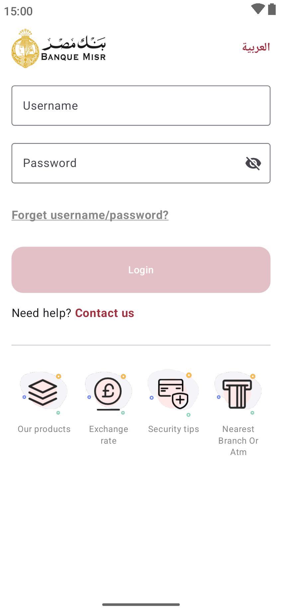
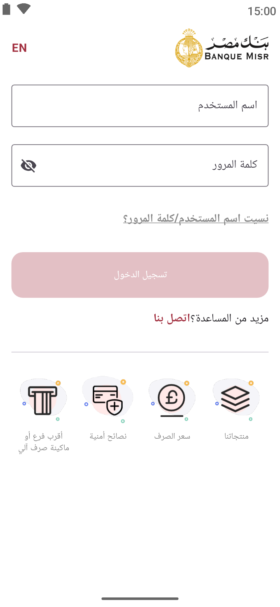

# Compose Playground

This project is a playground for building UIs with Jetpack Compose.

## Screenshots

| English                         | Arabic                            |
|---------------------------------|-----------------------------------|
|  |  |

## Features

* Login screen
* Language switching (English/Arabic)
* Bottom navigation with placeholder icons

## Building the project

To build the project, open it in Android Studio and run the `app` configuration.
